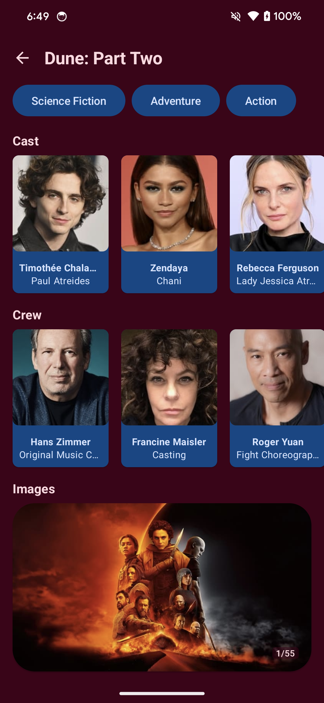

# Movie Roll

Movie Roll is a fully functional Android app built with Kotlin and Jetpack Compose. Movie Roll uses [The Movie Database (TMDB)](https://www.themoviedb.org/?language=en-US) API to showcase movies organized by both category and genre.

The app integrates Jetpack Compose for modern UI development, managing navigation with Hilt Navigation Compose and AndroidX Navigation. It incorporates features like paging and data storage using AndroidX Paging, Room, and DataStore. Networking capabilities are provided by Retrofit and OkHttp, with serialization handled by Kotlinx Serialization JSON. The app employs coroutines for asynchronous operations and utilizes Coil for image loading. Additionally, it includes testing frameworks like JUnit and Mockk for ensuring code quality. Security measures are implemented with the Secrets library. Overall, the app offers a rich user experience with modern UI elements, seamless navigation, efficient data handling, and robust networking functionalities.

The app adheres to Android design and development best practices, with features and functionality organized into modular components. Although this level of structuring may appear excessive for a sample application, its purpose is to demonstrate effective scalability in an enterprise environment. By breaking down features and functionality into modules, the app showcases how parallel development of numerous features can be efficiently managed. 

Movie Roll is a work in progress.


## Screenshots

 
 


## Installation

In order to run this app, you need a TMDB API key. The API key is free, to get your own please visit [Getting Started with TMDB](https://developer.themoviedb.org/reference/intro/getting-started). Once you have your API key, please find `local.properties` in the project structure and add your API key to `local.properties` as follows

```bash
  TMDB_ACCESS_TOKEN=<Your API Key>
```
    
